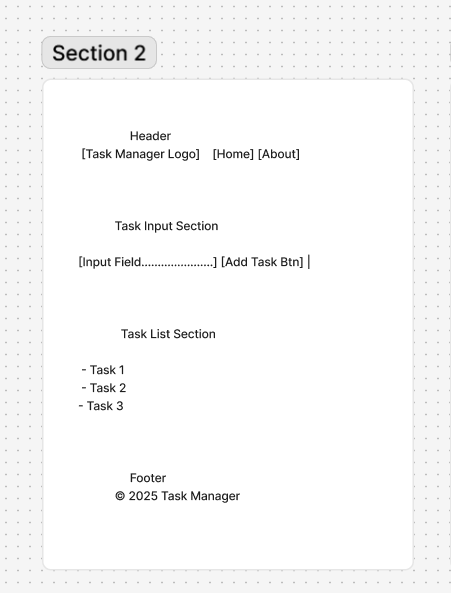
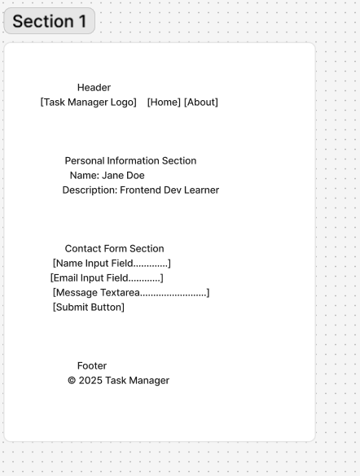

# -My-Tasks
# 📋 Task Manager Website

A simple task management app built using HTML, CSS, and JavaScript.

## 👤 About Me
Hi! I'm learning how to build websites. This project helps me practice DOM manipulation, layout design, and file organization.

## 📘 What I Learned

### From *Good Developer Mindset*
- A positive attitude helps overcome bugs.
- Collaboration and curiosity go a long way.

### From *Terminal Command Cheat Sheet*
- Learned how to use:
  - `cd`, `mkdir`, `touch`, `code .`
  - `git add`, `git commit`, `git push`

## 📁 Project Structure
task-manager/
├── index.html
├── about.html
├── css/
│ └── styles.css
├── js/
│ └── app.js
└── README.md

## 🖼️ Wireframes

*Add your wireframe screenshots here:*

